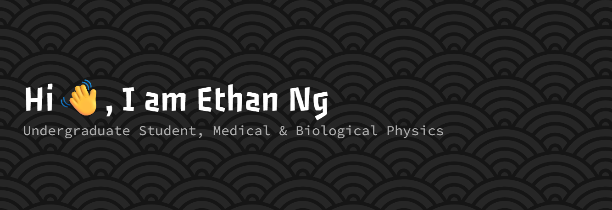

- 🎓 Studying Medical and Biological Physics at McMaster University  
- 🔬 Working on MRI phantoms for my undergraduate thesis 
- 🎨 I love making things — from art to random projects  
- 📚 Always picking up new side quests (coding, CAD, design, dance, and more)  
- 🌊 Fun fact: I go scuba diving whenever possible  

   

## 📊 Profile Summary
<table>
  <!-- Profile Details on top, full width -->
  <tr>
    <td colspan="2" align="center">
      
    </td>
  </tr>

  <!-- Other summary cards -->
  <tr>
    <td></td>
    <td></td>
  </tr>
  <tr>
    <td></td>
    <td></td>
  </tr>
</table>
 
## 🛠 Skills
- **Programming:** C++, Python  
- **Design Tools:** CAD, Blender, Figma  
- **Other:** Microsoft Office, Lab Techniques
 
 <!-- to be added
 ## 🚀 Featured Projects
- [Project Name](link) — One-liner about the project
- [Another Project](link) — Brief description
 -->
 
## 📚 Currently Learning
- 🈵 Japanese language (always expanding my side quests!)  
- 🖌 Experimenting with new art and design projects  
- 💻 New coding tricks and side projects in CAD, Blender, and Figma

## 🤝 Connect with me
- [LinkedIn](https://www.linkedin.com/in/engyuhin/)  
- [Email](mailto:nge18@mcmaster.ca)

  
